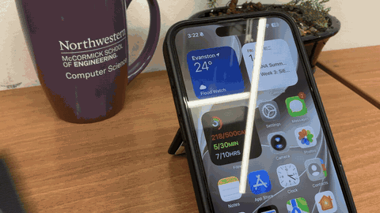
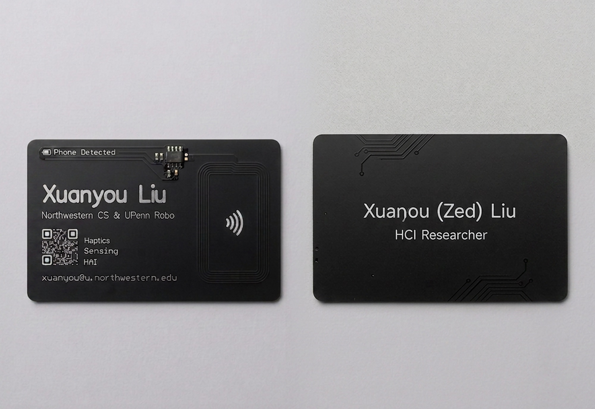

# NFC PCB business card

Copyright 2026 Xuanyou (Zed) Liu. SPDX-License-Identifier: CERN-OHL-P-2.0

Passive NFC business card built around the NXP NT3H2111W0FT1 (NTAG I2C plus). A phone tap reads the tag and opens a URL; harvested RF energy lights the on-board LED while the field is present.





Designed in Altium Designer. Open `altium/PCB_Business_Card.PrjPcb` to edit the schematic and board. Fabrication outputs are also in the repo if you only want to order.

## Specifications

| Item | Value |
| --- | --- |
| Form factor | ISO/IEC 7810 ID-1 (credit-card), 85.60 mm x 53.98 mm |
| Corner radius | 3.18 mm |
| Stackup | 2-layer |
| Finish (as built) | Black soldermask, white silkscreen, lead-free HASL (ENIG optional) |
| Thickness (as built) | 0.8 mm |
| NFC IC | NXP NT3H2111W0FT1, SOIC-8 |
| Antenna | On-board HF coil |
| Power | Harvested from the phone NFC field (no battery) |
| Status | Built and working, LED included; reads at about 1 cm with C1 unpopulated |

## How it works

The NT3H2111 is an ISO/IEC 14443-A NFC Forum Type 2 tag with energy harvesting (`VOUT`) and a field-detect pin (`FD`). The coil on the right side of the card is the antenna (`LA` / `LB`). When a phone is nearby, the IC wakes from the RF field; the LED path is biased from harvested power so the "Phone Detected" artwork can actually light up.

NDEF records (URL, vCard, or a small landing page) are written after assembly. These parts ship without a factory NDEF capability container, so each board needs a one-time raw-session "Format as NDEF" before iOS will write to it.

Antenna sizing, Q, trim-cap math, and the first-board bench notes are in [docs/antenna-design.md](docs/antenna-design.md).

## Repository layout

```text
altium/              Altium Designer project, schematic, PCB, libraries
bom/                 Bill of materials and pick-and-place
docs/                Render, schematic PDF, Gerber zip for fab houses
gerber/              Individual Gerber and Excellon drill files
mechanical/          3D STEP model
```

| Path | Contents |
| --- | --- |
| `altium/PCB_Business_Card.PrjPcb` | Altium project |
| `altium/PCB_Business_Card.SchDoc` | Schematic |
| `altium/PCB_Business_Card.PcbDoc` | Board |
| `altium/Schlib1.SchLib` | Schematic symbols |
| `altium/PcbLib1.PcbLib` | Footprints |
| `bom/bom.csv` | Parts list |
| `bom/pick-and-place.csv` | SMT placement, units in mil |
| `docs/antenna-design.md` | Coil math, Q, energy harvesting, bench notes |
| `docs/schematic.pdf` | Schematic |
| `docs/overview.jpg` | Front and back render |
| `docs/demo.gif` / `docs/demo.mp4` | Tap-to-open demo |
| `docs/gerber.zip` | Ready-to-upload fabrication archive |
| `gerber/*.gbr` | Copper, mask, silk, paste, outline, mechanical |
| `gerber/nc-drill.drl` | Excellon plated drill |
| `mechanical/pcb-business-card.step` | 3D model |

Gerber layer names:

| File | Layer |
| --- | --- |
| `copper-top.gbr` / `copper-bottom.gbr` | Signal copper |
| `soldermask-top.gbr` / `soldermask-bottom.gbr` | Soldermask |
| `silkscreen-top.gbr` / `silkscreen-bottom.gbr` | Legend |
| `paste-top.gbr` / `paste-bottom.gbr` | Stencil |
| `outline.gbr` | Board profile |
| `pads-top.gbr` / `pads-bottom.gbr` | Pad master |
| `mechanical-1.gbr`, `mechanical-13.gbr`, `mechanical-15.gbr` | Mechanical |
| `drill-map.gbr` / `drill-drawing.gbr` | Drill guide / drawing |
| `nc-drill.drl` | NC drill |

## Bill of materials

| Ref | Qty | Value | Footprint | Part |
| --- | --- | --- | --- | --- |
| C1 | 1 | 6.8 pF C0G (optional) | 0603 | DNP on board 1 |
| C2 | 1 | 150 nF | 0603 | CC0603KRX7R7BB154 |
| IC1 | 1 | NT3H2111W0FT1 | SOIC-8 | NT3H2111W0FT1 |
| LED1 | 1 | Red LED | 0603 | KT-0603R |
| R1 | 1 | 0 ohm | 0603 | 0603WAJ0000T5E |
| R2 | 1 | 100 k ohm | 0603 | RC0603FR-07100KL |
| R3 | 1 | 2.7 k ohm | 0603 | 0603WAF2701T5E |

## Ordering

1. Upload `docs/gerber.zip` to JLCPCB, PCBWay, or another fab.
2. 2 layers, black soldermask, white silkscreen. First lot used lead-free HASL; ENIG if you want the pads and name to stay bright.
3. 0.8 mm board thickness feels more like a card than 1.6 mm FR-4.
4. Assemble from `bom/bom.csv` and `bom/pick-and-place.csv`, or hand-solder: every part is on the top side. C1 (6.8 pF) is optional; see the antenna note.
5. Format the tag as NDEF in a raw NFC session, then write a URL or vCard.

Do not include the mechanical Gerbers in a fab upload if the house complains about extra layers; `docs/gerber.zip` already contains the usual set. Outline + copper + mask + silk + drill is enough for a bare board.

## License

Hardware design files in this repository are released under the [CERN Open Hardware Licence Version 2 - Permissive](LICENSE) (CERN-OHL-P-2.0).

The card artwork includes a personal name, affiliation, email, and QR code. Reuse the circuit and mechanics freely; replace the identity layer before you make cards for yourself.
